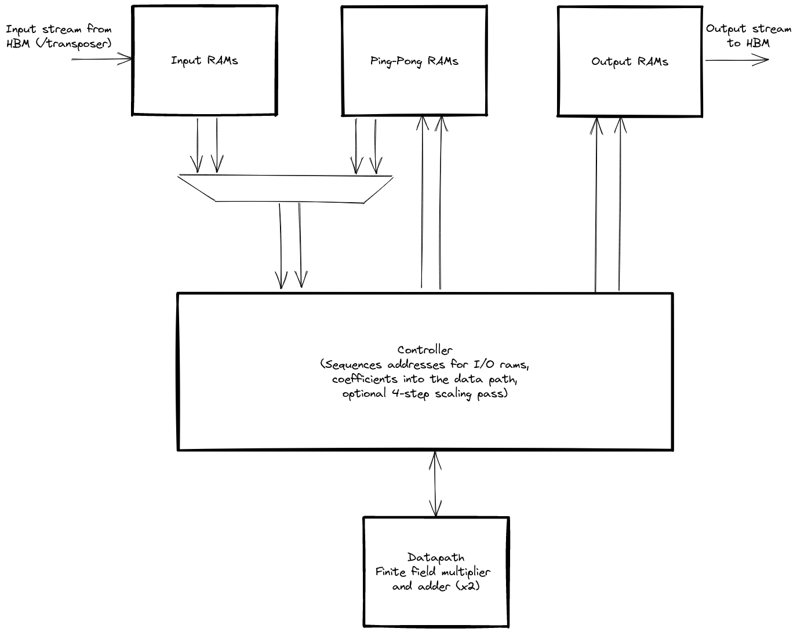

# Core (I)NTT design

The [core NTT design](https://github.com/fyquah/hardcaml_zprize/blob/master/libs/hardcaml_ntt/src/single_core.ml)
([code documentation](odoc/zprize/Hardcaml_ntt/Single_core/index.html))
performs transform of sizes which can fully fit within FPGA Block or UltraRAM
resources.  This limits us to transform sizes of around $2^16$.

The general architecture of the core NTT is shown in the diagram below.

The core is designed to perform one butterfly operation per cycle.  This involves two finite field
multiplications per cycle (one for the butterfly operation and one to update the root of unity).

To keep the data path fully utilised we need to be able to read and write two coefficients per cycle.
The various RAMs used to store coefficients are architected to allow two simultaneous read and
write ports.

For a size-$N$ transform (note $N$ is assumed to be a power of 2) we require $log_{2}N$ iterations.

Since we perform a full butterfly operation per cycle we require a total of $N/2 log_{2}N$ cycles
to perform the full transform.

The actual number of cycles is slightly larger than this.  In order to achieve a clock
rate of 250Mhz, the butterfly data path (including the finite field multiplier) must be pipelined.
The pipelining is currently set at 8 clock cycles.  After each NTT iteration we must account for
datapath pipelining to ensure data integrity.  At transform sizes greater than $2^8$ this extra
cost becomes negligible.

## Controller

The controller sequences a decimation in time NTT.

* Generates input and output addresses, including the required bit-reversal in the first iteration.
* Routes data to/from the appropriate RAM depending on the iteration.
* Synchronises RAM access with data pipelining after each iteration to ensure data integrity.
* Optionally controls the scaling step after the first pass in the full 4-step design.

## Data path

The [data path](https://github.com/fyquah/hardcaml_zprize/blob/master/libs/hardcaml_ntt/src/datapath.ml)
consists of 2 field [multipliers and adders](https://github.com/fyquah/hardcaml_zprize/blob/master/libs/hardcaml_ntt/src/gf.ml)
and takes and produces 2 coefficients per cycle.

The datapath is heavily pipelined, which is a problem for updating the root each cycle.  To
overcome this we implemented the
[twiddle factor stream](https://github.com/fyquah/hardcaml_zprize/blob/master/libs/hardcaml_ntt/src/twiddle_factor_stream.ml)
module.  This is initialised with the first few roots (in a small ROM) to hide the multiplier
latency while producing a new root each cycle.

In the full design, the data path is reused to perform the twiddle phase after the
first pass of the 4-step algorithm.  Each coefficient must be scaled by a specific
root of unity and then the root scaled.  This pass takes a further $N$ cycles and uses a
similar trick to the twiddle factor stream module to hide the multiplier latency.

## RAMs

We required 2 read and 2 write ports for all RAMs in the design.  This includes
the inputs RAMs, internal ping-pong RAMs, and output RAMs.

Since FPGA RAMs consist of 2 ports, we build the required structure from 2 UltraRAMs.
Each UltraRAM has both its ports connected to either the read or write side.

When a `flip` signal is toggled the port directions swap.

The RAMs are architected such that we can load new NTT coefficients and store
a processed NTT concurrently with an NTT computation.
