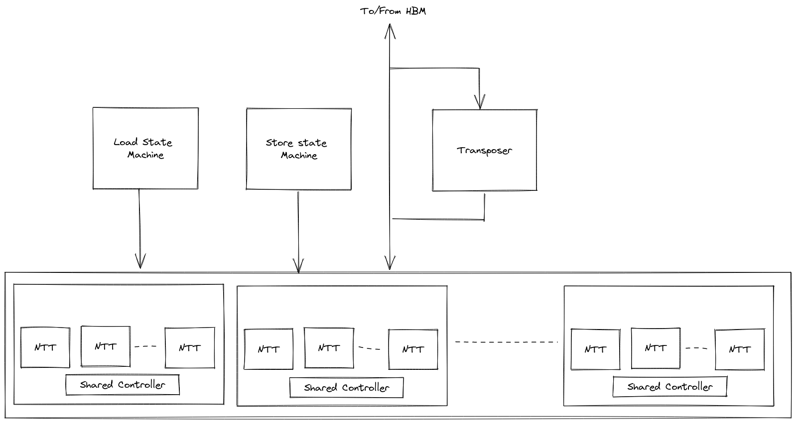
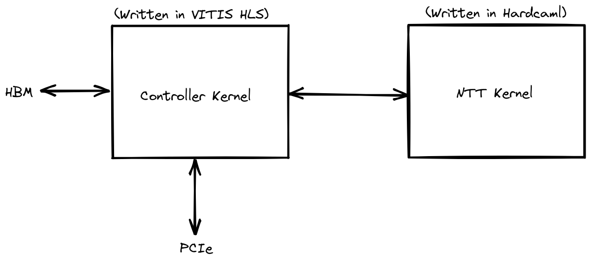

# Top-Level Hardcaml Design

The [top-level Hardcaml design](https://github.com/fyquah/hardcaml_zprize/blob/master/zprize/ntt/hardcaml/src/top.ml)
instantiates the [parallel NTT cores](ntt-performance-scaling.html)
along with state machines to sequence memory reads and writes and a transposer module.

The memory sequencers work in conjunction with a C++ HLS kernel to move data from memory
to the internal address space of the NTT cores and back again.

The transposer module is used to flip incoming data so it can be read and written
in parallel to the internal cores.  When we are reading the data for multiple rows during
the 2nd pass of the 4-step algorithm, we get 8 coefficients per cycle which need to be routed
to a single core.  However, each core can only accept 1 coefficient per cycle.

The transposer will read 8 coefficients per cycle and hold them.  Once enough rows are read, it
will output a column of 8 coefficients per cycle which can be loaded into a set of NTT input
RAMs.

# Vitis kernels

The top-level FPGA design is built using the Xilinx Vitis design flow.  It consists
of two kernels: the top level Hardcaml design, and a
[C++ HLS kernel](https://github.com/fyquah/hardcaml_zprize/blob/master/zprize/ntt/fpga/common/krnl_controller_normal_layout.cpp)
to interface with PCIe and HBM2 memory.

The C++ kernel coordinates the transfer of data...

1. ...from the host to HBM2 memory.
2. ...from HBM2 memory back to the host.
3. ...from HBM2 into the Hardcaml NTT kernel
4. ...from the NTT kernel into HBM

It is aware of the 2 passes of the 4-step algorithm and works in conjunction
with the Hardcaml memory sequencers.

>
