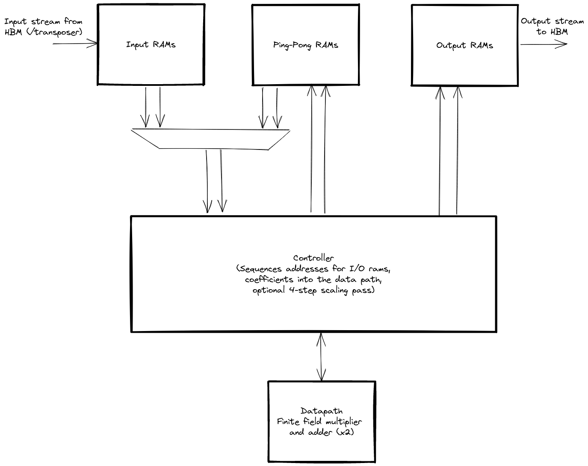

# Core (I)NTT design

The core INTT design performs transform of sizes which can fully fit within FPGA Block or UltraRAM
resources.  This limits us to transform sizes off around $2^16$.

The general architecture of the core INTT is shown in the diagram below.

>

The core is designed to perform one butterfly operation per cycle.  This involves two finite field
multiplications per cycle (one for the butterfly operation and one to update the root of unity).

To keep the data path fully utilized we need to be able to read and write two coefficients per cycle.
The various RAMs utilized to store coefficients are architected to allow two simultaneous read and
write ports.

For a size $N$ transform (note $N$ is assumed to be a power of 2) we require $log_{2}N$ iterations.

Since we perform a full butterfly operation per cycle we require a total of $N/2 log_{2}N$ cycles
to perform the full transform.

The actual number of cycles is actually slightly larger that this.  In order to achieve a clock
rate of 250Mhz, the butterfly data path (including the finite field multipler) must be pipelined.
The pipelining is currently set at 8 clock cycles.  After each INTT iteration we must account for the
datapath pipelining to ensure data integrity.  At transform sizes greater than $2^8$ this extra
cost becomes negligible.

* [Source code](https://github.com/fyquah/hardcaml_zprize/blob/master/libs/hardcaml_ntt/src/single_core.ml)
* [Code documentation](odoc/zprize/Hardcaml_ntt/Single_core/index.html)

## Controller

The controller sequences a decimation in time INTT.

* Generates input and output addresses, including the required bit-reversal in the first iteration.
* Routes data to/from the appropriate RAM depending on the iteration.
* Sychronises RAM access with data pipelining after each iteration to ensure data integrity.
* Optionally controls the scaling step after the first pass in the full 4-step design.

## Data path

The [data path](https://github.com/fyquah/hardcaml_zprize/blob/master/libs/hardcaml_ntt/src/datapath.ml) 
consists of 2 field [multipliers and adders](https://github.com/fyquah/hardcaml_zprize/blob/master/libs/hardcaml_ntt/src/gf.ml) 
and takes and produces 2 coefficients per cycle.

The datapath is heavily pipelined, which is a problem for updating the root each cycle.  To
overcome this we use the 
[twiddle factor stream](https://github.com/fyquah/hardcaml_zprize/blob/master/libs/hardcaml_ntt/src/twiddle_factor_stream.ml)
module which is initialized with the initial root values and produces a new one each cycle.

In the full design, the data path is reused to perform the twiddle phase after the
first pass of the 4-step algorithm.  Each coefficient must be scaled by a specific
root of unity and then the root scaled.  This pass takes a further $N$ cycles.

## RAMs

We required 2 read and 2 write ports for all RAMs in the design.  This includes
the inputs RAMs, internal ping-pong RAMs, and output RAMs.

Since FPGA RAMs consist of 2 ports, we build the required structure from 2 UltraRAMs.
Each UltraRAM has both it's ports connected to either the read or write side.

When a `flip` signal is toggled the port directions swap.

The RAMs are architectued such that we can load new INTT coefficents and store
a processed INTT concurrently with an INTT computation.

# Scaling

Our design can be parameterized by $logcores$ and $logblocks$.

The `Parallel_cores` block instantiates $2^{logcores}$ INTT blocks.  It also
defines the width of the data path into the cores.

The `Multi_parallel_cores` block instantiates $2^{logblocks}$ `Parallel_cores`
blocks. This the design scales with $2^(logcores + logblocks)$ cores.
