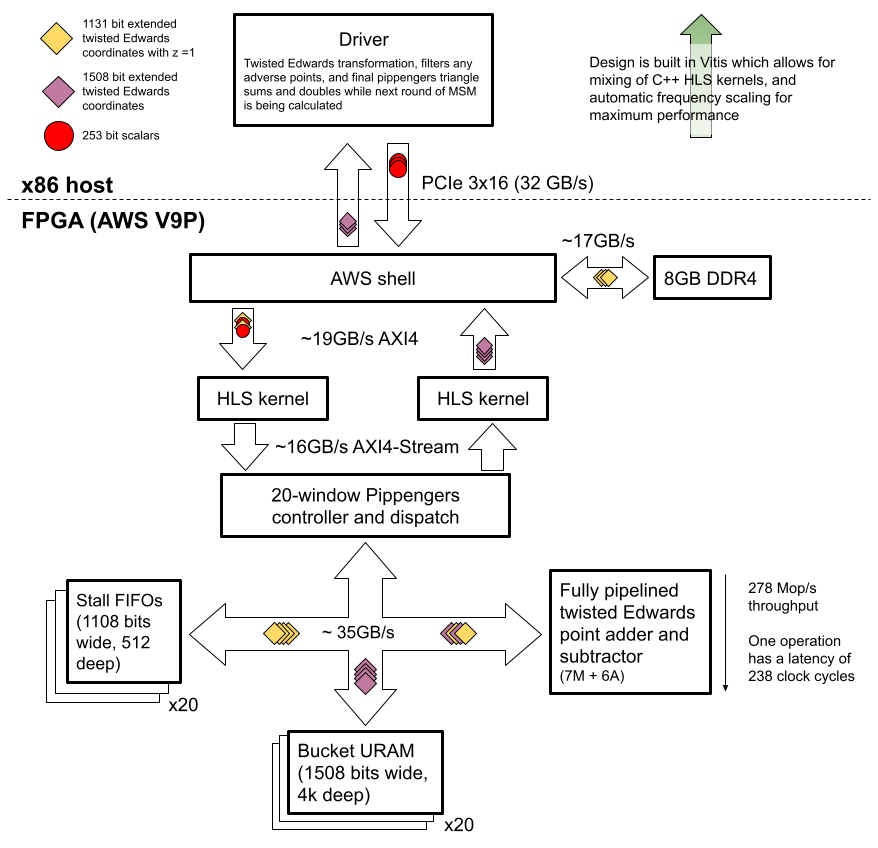

# FPGA Implementation of the MSM Pippengers algorithm

We have implemented an FPGA design that runs on an AWS F1 instance and can compute
the MSM of a large number of elliptic point and scalar pairs on the BLS12-377 G1
curve.

Performance is measured as per the ZPrize specs at 20.336s for 4 rounds of
226 MSMs, which equates to **13.200** Mop/s.

Detailed instructions on re-creating these results from source are in the
[building from source](#building-the-design-from-source) and more detailed
measurement results in the [benchmarking](#benchmarking) sections below.

## Overview of the architecture

We have implemented a heavily optimized version of [Pippenger's
algorithm](https://dl.acm.org/doi/abs/10.1137/0209022) in order to solve the MSM
problem.

We picked window sizes of between 12 and 13 bits, which allowed for efficient
mapping to FPGA URAM resources which are natively 4096 elements deep. Points are
transformed and pre-loaded into DDR-4, so that at run time only scalars are sent
from the host to the FPGA via PCIe. We implemented a single fully-pipelined
point adder on the FPGA which adds points to buckets as directed by the
controller until there are no more points left. The controller automatically
handles stalls (only accessing a bucket when it does not already have an
addition in-flight). Once all points have been added into buckets, the FPGA
streams back the result for the host to do the final (much smaller) triangle
summation. This approach allows us to focus on implementing a very high
performance adder on the FPGA (as these additions dominate Pippenger's
algorithm), and then leaving smaller tasks for the host to perform.

The above description overly simplifies the amount of optimizations and tricks we
have implemented to get performance. A summary of the optimizations are listed
out below.

## Key optimizations

 1. Early on we decided rather than implementing all of Pippenger's algorithm on
the FPGA, it would be better to only implement point additions, and focus on as
high throughput as possible. This decision also means the resource requirements
of the adder is drastically reduced, as we only require a mixed adder.
We implemented a fully pipelined adder which can take new inputs to add every clock
cycle, with a result appearing on the output after 238 clock cycles in the final version.

 2. Implementing an adder on affine or projective coordinates requires more FPGA
resources (DSPs, LUTs, carry chains, ...), so we investigated different
transforms we could do in advance that would reduce the complexity on the FPGA.
We ended up deciding to transform to a scaled twisted Edwards curve and a
coordinate system loosely based on extended coordinates, but with heavy
precomputation. This [document describes the the details of the
transformation](docs/optimizing_point_representation.md)
The pre-transformation from affine points on a Weierstrass curve to extended
projective points on an equivalent twisted Edwards curve significantly decreases
the computational complexity of point addition (removing some modulo adds and a
modulo multiplication by constant, compared to the vanila mixed addition formulae
for scaled twisted edwards curve).

    This transformation requires special care as there are 5 points on the Weierstrass
    curve that cannot map to our selected twisted Edwards curve. This is such a rare
    edge case that in generating 226 random points we never hit one, but
    we add a check in our driver to detect these and perform point multiplication on
    the host if needed. Corner case tests confirm this code works as expected.

 3. We mask PCIe latency and host-post-processing by allowing MSM operations to start
    while points are being streamed in batches from the host. When a result is being processed,
    we are also able to start the MSM on the next batch. This masks out the host post-processing
    latency for all but the last batch.

 4. Multiplier optimizations in the Barrett reduction algorithm so that constants
    require less FPGA resources.

 5. Instead of performing a full Barrett reduction or full modular addition/subtraction, we perform
 a coarse reduction and allow additive error to accumulate through our point adder. Then, we correct
 this error all at once using BRAMs as ROMs to store coefficients that can be used to reduce values
 in the range $[0,512q]$ to their modular equivalents in $[0,q]$. The implementation of the
 ROM-based fine-reduction is described [here in the Bram_reduce module's documentation](https://fyquah.github.io/hardcaml_zprize/zprize/Field_ops_lib/Bram_reduce/index.html).

 6. Selecting a bucket size that allows for efficient usage of FPGA URAM,
  allowing non-uniform bucket sizes, and pblocking windows to separate SLRs in
  the FPGA to avoid routing congestion.

 7. Scalars are converted into signed form and our twisted Edwards point adder is
    modified to support point subtraction, which allows all bucket memory to be
    reduced in half. The details of the scalar transformation are described
    [here in the Scalar_transformation module's documentation](https://fyquah.github.io/hardcaml_zprize/zprize/Msm_pippenger/Scalar_transformation/index.html).

 8. Host code is optimized to allow for offloading the final triangle sum and
    bucket doubling operations.

## Block diagram

A high level block diagram showing the different data flows and modules used in
our MSM implementation.

